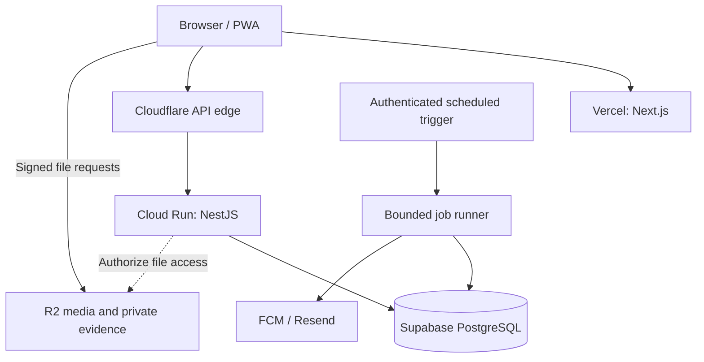

# Acticlaim infrastructure decisions

Agreed 30 September 2026. This document records the target architecture, not a deployed system. It supersedes earlier provider suggestions in the PRD. No infrastructure, credentials, workflows or runtime code are introduced by this decision.

## Objective

Target approximately $0 fixed infrastructure cost during validation, excluding the domain, reward backing and external transaction costs. Free allowances are finite and can change; this is not a guarantee of a zero bill or capacity for a particular user count. Use recurring allowances first. Eligible Google Cloud trial credit is a temporary buffer, not the operating model.

Preserve working components. Every infrastructure addition must solve a concrete Acticlaim problem. Keep one modular backend and one primary database; no Kubernetes, Kafka, Terraform or microservices.

## Selected services

| Component            | Decision                                              | Purpose                                                               |
| -------------------- | ----------------------------------------------------- | --------------------------------------------------------------------- |
| Web                  | Existing Next.js on Vercel                            | Web application and eventual PWA                                      |
| API                  | Existing NestJS on Cloud Run                          | Authentication and domain operations                                  |
| Database             | Supabase Free PostgreSQL                              | Primary system of record, accessed only by the backend                |
| Database access      | Existing Drizzle and standard pg driver               | Portable SQL and reviewed migrations                                  |
| Authentication       | Existing Better Auth                                  | PostgreSQL-backed identities and sessions; no Supabase Auth migration |
| DNS                  | Cloudflare                                            | Stable application hostnames independent of hosting                   |
| API edge             | Cloudflare proxy where origin controls are validated  | TLS and DDoS protection; no caching of authenticated responses        |
| Media                | Cloudflare R2 Standard                                | Public marketing assets and private evidence                          |
| Abuse challenge      | Cloudflare Turnstile                                  | Additional protection for sensitive actions                           |
| Background work      | PostgreSQL jobs and authenticated scheduled execution | Durable delivery, retries and scheduled processing                    |
| In-app notifications | PostgreSQL                                            | Notification history, preferences and read state                      |
| Push                 | Firebase Cloud Messaging                              | Delivery to registered devices/installations                          |
| Email                | Existing Resend delivery                              | Authentication and selected transactional messages                    |
| Observability        | Structured logs and basic alerts                      | Diagnose failures, queue delays and consumption                       |
| Source of truth      | Existing GitHub repository                            | Reviewed source, migrations and documentation                         |

Vercel remains the selected frontend host. Use Cloudflare DNS-only for its hostname initially; Vercel provides frontend CDN/TLS/edge protection. Do not stack another proxy/cache in front of Vercel without a demonstrated requirement and compatibility checks. Cloudflare API protection depends on validated origin restrictions and trusted forwarding headers; DNS alone provides no application proxy protection.

InstaCloud, AWS and Contabo remain future alternatives, not additional initial services. No application-level InstaCloud integration is needed.

## Topology

The runner belongs to the same backend codebase. Both a finite email-worker CLI and a separate protected HTTP entry point now exist; neither scheduling nor cloud deployment is configured. See EMAIL_QUEUE.md for invocation and INGRESS.md for origin security and client-IP release gates.

## Existing implementation versus planned work

Implemented: API modules, PostgreSQL schema/migrations, account management, Better Auth, durable encrypted authentication-email jobs, finite worker CLI, Next.js account journeys and shared contracts. A non-root API Dockerfile, health endpoints and shutdown handling exist.

The internal sponsor ledger (migration 0007), owner-authorized funded task creation (0008), and internal audited review decisions (0009) now exist; see FUNDING_LEDGER.md, SPONSOR_TASKS.md and TASK_REVIEW.md. Tasks start pending review and remain not live even after approval. No admin review endpoint exists until real MFA/session assurance is implemented. Not deployed or implemented: hosting, scheduled worker invocation, backup automation, R2 uploads, Turnstile, general domain events/jobs, in-app notifications, FCM/PWA, task publication/participation/rewards, live payments and redemptions. Database concurrency, actual container operation and production delivery still require verification.

## Database and portability

Use Supabase only as a PostgreSQL host. Keep Better Auth, business rules and authorization in NestJS. Do not introduce Supabase Auth, Storage, Edge Functions or browser database access. Restrict/disable unused Data API exposure and review grants so domain tables cannot be read through an unintended public API.

Use standard UUIDs, constraints, transactions, indexes and SQL migrations. Store accounts, businesses, campaigns, missions, submissions, file metadata, ledger records, followers, notification preferences/history, audit records and external references here as their features are implemented. Do not create all planned tables merely for infrastructure completeness.

Select runtime and migration connections separately. Transaction pooling may suit runtime traffic after compatibility tests; migrations require a direct or session-preserving connection for the existing advisory lock. Check Supabase IPv4/IPv6 connectivity from Cloud Run and the supported session pooler before choosing endpoints. Retain certificate validation; review connection URL parameters against the existing strict parser.

Keep API connection pools small. Total API-instance pools, worker pools, migration connections and operational headroom must fit the database limit. Place API and database in geographically close available regions and measure latency from Nigeria. Cross-provider network transfer is part of the cost budget.

Free Supabase does not include automatic backups. Before real accounts or funds, arrange scheduled encrypted PostgreSQL exports, separate restricted backup storage/credentials, retention and a restore drill. Include backup bytes and transfer in budgets. Set explicit recovery objectives before accepting real financial obligations. A live database or an untested export is not a recovery plan.

## Events, jobs and financial safety

Keep core state changes in explicit application commands and database transactions. Introduce a small typed EventBus when a domain feature needs events. In-process events are only suitable where loss is acceptable or effects are safely recomputable.

Persist critical events/jobs in the same PostgreSQL transaction as their state change. Use an outbox for durable publication and idempotent handlers. Do not depend on fire-and-forget execution after an HTTP response. This is not event sourcing and does not require a separate broker.

Preserve the existing email queue's encryption, stable delivery keys, bounded retries, leases and stale-worker fencing. Reuse its patterns without replacing its working auth integration with a generalized framework. A future runner must have both batch and wall-clock limits, controlled concurrency, backoff and inspectable failed work. Provider calls run outside database locks.

Scheduled execution must wake work independently of user traffic. Evaluate Cloud Scheduler authenticated invocation, its allowance, target compute charges and retry behaviour before deployment. Choose the smallest reliable schedule; do not start an always-running empty worker or rely on timers in a scaled-to-zero API. Campaign activation/expiry eligibility must also be checked at command time, so delayed maintenance cannot permit invalid claims.

Task creation must transactionally lock the sponsor allocation. Publication still requires review and confirmed funding. Approval and ledger transitions must commit atomically; notification failure must not undo earnings or release funds. An external timeout is an uncertain payment, not permission to send a new payment. Persist stable references and reconcile before retrying ambiguous financial operations.

## Notification ownership

NotificationService owns why, who, content, preferences, associated entities and channel selection. Providers only deliver. PostgreSQL remains authoritative for audiences, follows, in-app history and read state.

When implemented, store notification ID, recipient, type, entity, metadata, createdAt and readAt. Track channel/destination delivery attempts separately; accepted, delivered and read are different states. Deduplicate notifications by business event/recipient/type and deliveries by notification/channel/destination where appropriate.

Support multiple device/installations per account, provider registration refresh, invalidation and removal. Safely detach/rebind registrations on logout or account switching. Do not store one permanent push token on a user row. Isolate the browser registration/service-worker integration as well as the server adapter; a future provider change may require client changes and re-registration.

Campaign audience fan-out must use bounded, resumable batches and current preference checks. Keep authentication/recovery capacity separate from promotional traffic. Push is optional delivery: permission denial, unsupported browsers and offline devices must not prevent in-app history. Refresh authoritative state on open/reconnect; no periodic browser polling is required initially. PWA caches must exclude private API/auth data. iOS Home Screen installation and browser permission requirements cannot be bypassed by a provider.

SMS remains disabled initially. Before activation require a justified use case, per-recipient limits, atomically reserved daily/monthly spending budgets, an emergency disable switch and retry-safe delivery policy. OneSignal and marketing journeys wait for concrete requirements.

## Storage and provider boundaries

Introduce narrow interfaces with the first consuming feature, not speculative implementations for every provider:

| Boundary                         | Initial responsibility / implementation                                                                |
| -------------------------------- | ------------------------------------------------------------------------------------------------------ |
| StorageProvider / StorageService | R2 adapter: upload, delete, metadata and signed upload/download; service enforces ownership and policy |
| EmailProvider                    | Existing Resend sender behind a normalized delivery contract                                           |
| PushProvider                     | FCM delivery and normalized invalid-registration results                                               |
| BotChallengeVerifier             | Turnstile token, action and hostname verification                                                      |
| EventBus                         | Typed internal dispatch and explicitly durable publication                                             |
| Job store / runner               | PostgreSQL claim, retry, finish and failure inspection                                                 |
| Payment provider                 | Selected integration's operations, references and normalized status                                    |
| SmsProvider                      | Future paid delivery under application spending policy                                                 |

PostgreSQL stores object ownership, keys, size/type/checksum, validation status and business relationships, not large file bytes or permanent provider URLs. Use short-lived signed uploads into private quarantine. Validate actual size/content, scan or safely transform allowed types, and finalize into server-controlled immutable objects before attachment. Prevent upload URL reuse from overwriting accepted evidence. Add per-user quotas and orphan cleanup.

Separate approved public assets from private evidence. R2 presigned requests use the S3 API hostname, not the public media custom domain. Treat signed URLs as bearer credentials and exclude them from logs. Do not enable arbitrary documents, archives or video without the corresponding validation and processing budget.

## Webhooks, security and observability

Verify provider signatures against the exact raw request bytes, then record important events durably before acknowledging. Use unique provider/event IDs, bounded retained payloads, processing states, safe retries and out-of-order transition checks. Signature verification remains provider-specific even with shared inbox processing. Webhooks and job triggers use machine authentication rather than browser session/origin requirements.

Use least-privilege secrets and separate development/production configuration. Only deployment tooling needs cloud control-plane credentials. API, worker and migration processes should receive only their required credentials. No secrets in NEXT_PUBLIC variables or Git.

Retain HTTPS, exact CORS/trusted origins, secure host-only cookies and backend authorization. Add endpoint-specific abuse limits and Turnstile where justified. Never trust Turnstile as proof of task completion or reward eligibility. Validate ingress and client-IP handling rather than trusting arbitrary forwarding headers. Keep authenticated responses and evidence out of shared caches.

Log structured request, event, job and operation IDs, actor/entity IDs where appropriate, outcome, attempt and safe failure category. Never log passwords, cookies, access/reset tokens, secrets, signed URLs or sensitive payment payloads. Audit sensitive admin/business actions separately from diagnostic logs. Start with queue age/failure, database health, error-rate and spending alerts; defer a separate observability platform.

## Configuration

Retain current names rather than rename working configuration:

| Scope                  | Existing variables                                                                                                                                          |
| ---------------------- | ----------------------------------------------------------------------------------------------------------------------------------------------------------- |
| Web, public build-time | NEXT_PUBLIC_API_ORIGIN                                                                                                                                      |
| Runtime                | NODE_ENV, PORT, CORS_ORIGINS                                                                                                                                |
| Database               | DATABASE_URL, DATABASE_SSL_MODE, DATABASE_POOL_MAX, DATABASE_CA_CERT                                                                                        |
| Migration only         | MIGRATION_DATABASE_URL                                                                                                                                      |
| Reviewer provisioning  | REVIEWER_PROVISIONING_DATABASE_URL, REVIEWER_OPERATOR_ACCOUNT_ID, REVIEWER_OPERATOR_TOKEN, REVIEWER_OPERATOR_TOKEN_SHA256 (local tool only; not configured) |
| Authentication         | AUTH_SECRET, AUTH_BASE_URL, AUTH_TRUSTED_ORIGINS                                                                                                            |
| Auth email             | EMAIL_FROM, AUTH_EMAIL_ENCRYPTION_KEY, AUTH_EMAIL_DAILY_LIMIT                                                                                               |
| Delivery               | RESEND_API_KEY; EMAIL_WORKER_MAX_DURATION_MS (default 60000)                                                                                                |

Use stable app and api hostnames under the same HTTPS site. Current SameSite=Lax sessions do not support unrelated frontend/API provider domains. Changing NEXT_PUBLIC_API_ORIGIN requires a web rebuild; moving hosting behind the same API hostname does not.

Future feature configuration: storage endpoint/region/buckets and scoped credentials, upload quotas, Turnstile public site key/server secret and expected hostnames/actions, job-trigger authentication and execution limits, public Firebase configuration/VAPID key and private server credentials, provider webhook signing secrets. Add SMS configuration only when SMS is implemented. These are proposed configuration groups, not currently accepted environment variables.

## Cost controls and growth

Allowances checked 30 September 2026; verify again before provisioning:

- Supabase Free: 500 MB database, shared CPU/500 MB RAM, 5 GB egress; inactivity pause after one week; no included automatic backups. Pro starts at $25/month. Measure growth and compare alternatives before upgrading.
- Cloud Run request-based billing: recurring allowance of 2 million requests, 180,000 vCPU-seconds and 360,000 GiB-seconds, calculated using Tier 1 pricing and shared at billing-account level. Start with zero minimum instances and bounded maximum instances. Network, image registry, builds, secrets, schedules and logs may have separate charges. Alerts and instance limits are not a hard total-spend cap.
- Google trial: eligible new customers receive $300 valid for 90 days. Do not activate or size resources around assumed credit availability; verify the account first and plan beyond expiry.
- R2 Standard: 10 GB-month, 1 million Class A and 10 million Class B operations monthly, with free egress. Budget backups and retained evidence as well as current media.
- FCM delivery is no-cost; Resend Free includes 3,000 emails/month and 100/day. Current auth request reservations default to 100 per 24-hour window and are not identical to provider delivery counts. Reserve recovery capacity before promotional mail is added.

Supabase was selected over Neon Free for this workload because frequent database-backed jobs may prevent Neon from sleeping. Neon's 100 CU-hour monthly allowance would not cover 0.25 CU active continuously for 30 days (180 CU-hours). This is a workload assumption to measure, not a claim that Neon is always more expensive. Do not generate artificial traffic to avoid provider inactivity policies.

Review actual consumption at 10, 100, 1,000, 5,000 and 10,000 users without automatic upgrades. Track peak concurrency, database/index growth, connection pressure, job age, retained file bytes, fan-out volume, email limits and network transfer. There is no verified capacity promise for thousands of active users yet.

Do not add Redis/Upstash, D1, KV, Durable Objects, Workers, Queues, Kafka, RabbitMQ, extra databases, permanent sockets or dedicated analytics infrastructure solely because an allowance is available. Preserve planned product analytics through focused records/aggregates when the feature is implemented.

## Release sequence and known gaps

1. Verify provider accounts, regions, TLS/connectivity, connection budgets, backups and measured consumption. No service has been provisioned by this decision.
2. Implemented: separate API and email-worker parsers; migrations already read only database configuration. API no longer requires the Resend key; worker no longer requires auth/browser settings. Provision separate secret environments at deployment.
3. Implemented: shared exact-origin validation allows non-production loopback HTTP while production auth/trusted/CORS origins remain HTTPS-only.
4. Validate proxy-derived IP handling; current auth uses the socket address, which can group users behind ingress.
5. CLI deadline implemented: EMAIL_WORKER_MAX_DURATION_MS covers async processing and cleanup, with failed exit/lease recovery on expiry. Configure external timeout, authenticated wakeups and expired/dead-job monitoring; no scheduler or HTTP runner is implemented yet.
6. Run native PostgreSQL concurrency and migration checks, build/smoke-test the actual container, test real domains/cookies and verify live email delivery.
7. Implement restore-tested encrypted backups, deployment rollback and critical audit/security controls before real funds.
8. Add storage, events, ledger/task workflows and notifications in their owning feature commits. Review blanket web cache headers before publishing public cacheable content; retain private-data protections.

No CI/CD workflows or new branches are part of this plan. The repository contains an older CI workflow with stale container authentication configuration; leave it untouched until separately authorized cleanup. Use local checks and atomic commits on develop.

## Future migration

Run the same backend image as API and worker on Contabo, AWS, GCP or another container host. A VPS can initially retain the managed database, R2 and delivery providers. Optional Redis requires measured need.

For a database move: rehearse pg_dump/pg_restore, roles, migrations and checks; preserve auth secrets, queue encryption keys, pending jobs, ledger history and idempotency records. Pause writers and workers for final cutover, verify the new database and switch the stable API hostname. Resume only one authoritative writable database/processing deployment. Define rollback before accepting new writes; do not casually switch back to a stale database. Current TLS configuration needs explicit review for non-loopback Docker database hostnames.

## Sources

- [Cloud Run pricing](https://cloud.google.com/run/pricing)
- [Google Cloud free program](https://docs.cloud.google.com/free/docs/free-cloud-features)
- [Cloud Scheduler pricing](https://cloud.google.com/scheduler/pricing)
- [Supabase pricing](https://supabase.com/pricing)
- [Supabase PostgreSQL connections](https://supabase.com/docs/guides/database/connecting-to-postgres)
- [Neon plans](https://neon.com/docs/introduction/plans)
- [R2 pricing](https://developers.cloudflare.com/r2/pricing/)
- [R2 signed URLs](https://developers.cloudflare.com/r2/api/s3/presigned-urls/)
- [Turnstile validation](https://developers.cloudflare.com/turnstile/get-started/server-side-validation/)
- [Firebase pricing](https://firebase.google.com/pricing)
- [FCM web setup](https://firebase.google.com/docs/cloud-messaging/web/get-started)
- [Apple web push requirements](https://developer.apple.com/documentation/usernotifications/sending-web-push-notifications-in-web-apps-and-browsers)
- [Resend pricing](https://resend.com/pricing)
- [Cloudflare with Vercel](https://vercel.com/kb/guide/cloudflare-with-vercel)
